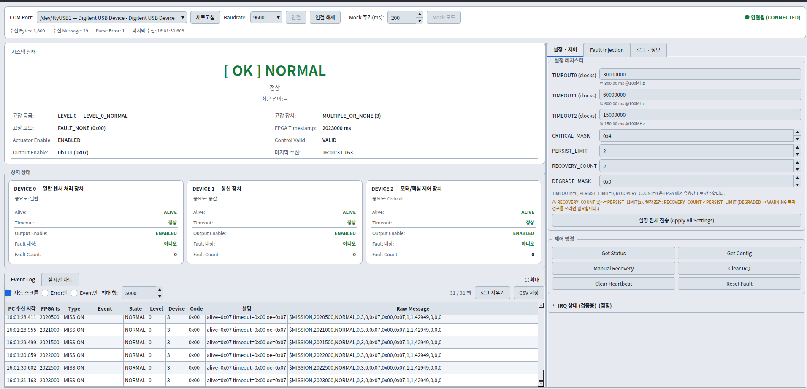

<div align="center">

# 🛰️ Mission SoC

### 임무컴퓨터 상태 감시·고장 대응 SoC · Custom IP 3종 안전 체인 · MicroBlaze RISC-V · 실시간 관제 GUI

<p>
  
  
  
  
  
  
</p>

<!-- TODO: asset/ 폴더에 보드 사진과 GUI 캡처를 추가한 뒤 주석을 해제하세요. -->
<p>
  
  &nbsp;&nbsp;
  <!--  -->
</p>

**세 개의 Custom IP가 FPGA 내부에서 직접 연결되어 고장을 감지·등급화·차단하고, MicroBlaze는 설정과 보고만 담당하며, PC 대시보드는 안전 판단에 전혀 관여하지 않는 임무컴퓨터형 안전 SoC입니다.**

### 🎥 시연 영상


https://github.com/user-attachments/assets/309fbf5f-ca7d-4d27-9868-a485077f600c

</div>

---

## 1. Project Overview

이 프로젝트의 핵심 설계 원칙은 **"안전 판단 경로에 소프트웨어를 두지 않는다"** 입니다.

일반적인 SoC 실습은 CPU가 센서를 폴링하고 판단해 출력을 끊습니다. 그러면 펌웨어가 죽거나 UART가 끊기는 순간 안전 기능도 함께 죽습니다. 그래서 `heartbeat_monitor → fault_manager → safety_controller` 세 Custom IP를 **AXI를 거치지 않고 RTL 신호로 직접 연결**했습니다. MicroBlaze는 부팅 시 설정을 쓰고, IRQ를 받아 상태를 UART로 보고할 뿐이며, **MicroBlaze가 정지해도 고장 판정과 SAFE_MODE 전환은 계속 동작합니다.**

Fault 등급화는 두 개의 시간 축을 씁니다. Critical 조건과 다중 장치 고장은 **매 클럭 즉시** 판정하고, "얼마나 오래 지속되었는가"는 공통 `eval_tick`(1 ms) 에서만 셉니다. `fault_manager`의 지속 Count와 `safety_controller`의 복구 Count가 같은 tick을 공유하므로, `RECOVERY_COUNT < PERSIST_LIMIT` 같은 정책 관계가 두 IP 사이에서 성립합니다.

PC 대시보드(PySide6)는 **양방향 제어 단말이지만 안전 판단은 하지 않습니다.** 수신값을 그대로 표시하고, 정책과 어긋나면 `POLICY WARNING` 로그만 남길 뿐 값을 덮어쓰지 않습니다. `Manual Recovery` 성공 여부도 앱이 가정하지 않고 FPGA의 `$ACK` 또는 새 `$MISSION` 으로만 확인합니다.

| 항목 | 내용 |
|---|---|
| 프로젝트 형태 | 팀 프로젝트 (3인) <!-- TODO: 본인이 담당한 IP/영역을 확정해 주세요. 저장소 구성상 fault_manager_ip(팀원 B) + 통합 펌웨어 + 대시보드로 보입니다 --> |
| 담당 범위 | <!-- TODO: 예) fault_manager_ip RTL·AXI·검증 / MicroBlaze 통합 펌웨어 / PC 대시보드 --> |
| 대상 보드 | Digilent Basys 3 (Xilinx Artix-7, `xc7a35tcpg236-1`) |
| System Clock | 100 MHz (Block Design의 Clock Wizard) |
| HDL / Language | Verilog, C (MicroBlaze), Python 3.11+ (대시보드) |
| Tool | AMD Vivado 2024.2, AMD Vitis Unified IDE 2024.2 |
| Soft Core | MicroBlaze RISC-V + AXI INTC + AXI UARTLite + AXI GPIO ×2 |
| Custom IP | `heartbeat_monitor_ip`(A), `fault_manager_ip`(B), `safety_controller_ip`(C) |
| 공통 RTL | `eval_tick_generator` (AXI 없음, Module Reference — 네 번째 IP 아님) |
| PC 통신 | UART 9600 8N1, ASCII 라인 프로토콜 (`$MISSION` / `$EVENT` / `$ACK` / `$ERR` / `$IRQ`) |

---

## 2. Key Features

| 기능 | 구현 내용 |
|---|---|
| **RTL 직결 안전 체인** | `timeout → fault_level → system_state → output_enable` 이 CPU를 거치지 않고 RTL 신호로 연결 |
| **Heartbeat Timeout 판정** | 장치별 32-bit Saturating Counter, `ASYNC_REG` 2FF 동기화 + Rising Edge 검출 |
| **5단계 Fault 우선순위** | Critical → 다중 장치 → 지속 일반 → 일시 일반 → 정상 (높은 것이 낮은 것을 덮어씀) |
| **Two Time Axes** | Critical/다중은 매 클럭 즉시, 지속·복구 Count는 공통 `eval_tick`(1 ms)에서만 |
| **4-State Safety FSM** | `NORMAL` / `WARNING` / `DEGRADED` / `SAFE_MODE`, 악화는 즉시·복구는 연속 확인 |
| **SAFE_MODE Latch** | 자동 복구 없음. `fault_valid=1 && fault_level=0` + `MANUAL_RESET` W1P 동시 성립에서만 해제 |
| **장치 단위 출력 차단** | `DEGRADED`에서 고장 장치만 `output_enable` 차단, 장치 특정 불가 시 `DEGRADE_MASK` 적용 |
| **Level IRQ + W1C** | 세 IP 모두 `irq = irq_status & irq_en`. Pending Set은 `IRQ_EN`과 무관 |
| **ISR Snapshot Ring** | 폴링 주기(5 ms)보다 짧게 스쳐 가는 전이를 ISR이 깊이 16 Ring에 떠서 보존 |
| **Non-blocking UART** | 자체 `PROTO_Printf`가 TX 한 글자마다 RX FIFO를 Ring으로 퍼담아 명령 유실 차단 |
| **UART 양방향 프로토콜** | `GET` / `SET` / `CMD` / `INJECT` 수신, 모든 명령에 `$ACK` 또는 `$ERR` 응답 |
| **Fault Injection** | AXI GPIO로 `error_flag` / `critical_fault` 즉시 주입, Timeout은 Heartbeat 정지로 유도 |
| **PySide6 대시보드** | 실시간 카드·차트·Event Log·CSV 저장, FPGA 없이 도는 `MockDevice` 내장 |
| **AXI4-Lite 자체 구현** | AW/W 독립 수신 후 1회 Commit, WSTRB 부분 쓰기, W1P / W1C / RO 혼합 레지스터 |

---

## 3. System Architecture

```text
                        ┌──────────── FPGA (Basys 3) ─────────────────────────────┐
                        │                                                          │
 axi_gpio_1 CH1 ───────►│ heartbeat_async[2:0]                                     │
 (MicroBlaze가 생성)     │        ▼                                                  │
                        │  ┌──────────────────────┐                                │
                        │  │ heartbeat_monitor_ip │ (A)                            │
                        │  │  2FF 동기화 + Edge    │                                │
                        │  │  장치별 경과 Counter  │                                │
                        │  │  Timeout / Alive 판정 │                                │
                        │  └───────┬──────────────┘                                │
                        │          │ timeout[2:0]        alive[2:0] ──► LED         │
 axi_gpio_0 CH1 ───────►│ error_flag[2:0]                                           │
 axi_gpio_0 CH2 ───────►│ critical_fault[2:0]                                       │
                        │          ▼                                                │
                        │  ┌──────────────────────┐        ┌────────────────────┐  │
                        │  │  fault_manager_ip    │ (B) ◄──┤ eval_tick_generator│  │
                        │  │  중요도 · 지속 횟수   │        │ 100,000 clk = 1 ms │  │
                        │  │  Fault Level 결정     │        └─────────┬──────────┘  │
                        │  └───────┬──────────────┘                  │             │
                        │          │ fault_level[1:0]                │             │
                        │          │ fault_device[1:0]               │             │
                        │          │ fault_code[7:0]                 │             │
                        │          │ fault_valid                     │             │
                        │          ▼                                 ▼             │
                        │  ┌───────────────────────────────────────────┐           │
                        │  │        safety_controller_ip (C)           │           │
                        │  │  상태 FSM · SAFE_MODE Latch · 출력 제어    │           │
                        │  └───────┬───────────────────────────────────┘           │
                        │          │ system_state[1:0] / output_enable[2:0]         │
                        │          │ actuator_enable / control_valid                │
                        │          ▼                                                │
                        │      led_concat ──► led[15:0] (LD0~LD15)                  │
                        │                                                           │
                        │  각 IP ── AXI4-Lite ──┐                                   │
                        │  각 IP irq ── xlconcat ── AXI INTC ──┐                    │
                        └──────────────────────────────────────┼────────────────────┘
                                                  ▼            ▼
                                          ┌──────────────────────────┐
                                          │ MicroBlaze RISC-V        │
                                          │  설정 · IRQ 수집 · 보고   │
                                          └───────────┬──────────────┘
                                                      │ AXI UARTLite 9600 8N1
                                                      ▼
                                          ┌──────────────────────────┐
                                          │ PC Dashboard (PySide6)   │
                                          │  모니터링 · 명령 · CSV    │
                                          └──────────────────────────┘
```

`alive`는 Fault Manager 입력이 **아닙니다.** Fault Manager에는 `timeout`만 직접 연결하고, `alive`는 LED와 상태 표시용으로만 씁니다.

### 3.1 Address Map

| Peripheral | Base | 비고 |
|---|---|---|
| `fault_manager_ip_0` | `0x44A00000` | `ID` 레지스터(`"FMGR"`)로 매핑 자체 검증 |
| `myip_heartbeat_monit_0` | `0x44A10000` | |
| `safety_controller_0` | `0x44A20000` | |
| `axi_gpio_0` | `0x40000000` | CH1 `error_flag[2:0]`, CH2 `critical_fault[2:0]` |
| `axi_gpio_1` | `0x40010000` | CH1 `heartbeat_async[2:0]` |
| `axi_uartlite_0` | `0x40600000` | 9600 8N1 |
| `axi_intc_0` | `0x41200000` | |

### 3.2 IRQ 연결 순서 (변경 금지)

`xlconcat` 연결 순서가 곧 `XIntc` 인터럽트 ID입니다.

| ID | 소스 |
|---:|---|
| 0 | `axi_uartlite_0/interrupt` |
| 1 | `fault_manager_ip_0/irq` |
| 2 | `myip_heartbeat_monit_0/irq` |
| 3 | `safety_controller_0/irq` |

---

## 4. Heartbeat Monitor (IP A)

장치 3개의 Heartbeat 펄스를 감시해 `alive` / `timeout`을 만듭니다.

```verilog
// 비동기 입력 → 2FF 동기화 → Rising Edge 1클럭 펄스
(* ASYNC_REG = "TRUE" *) reg heartbeat_sync_ff1;
(* ASYNC_REG = "TRUE" *) reg heartbeat_sync_ff2;
reg heartbeat_sync_d;

assign heartbeat_pulse = heartbeat_sync_ff2 & ~heartbeat_sync_d;
```

```verilog
// Saturating Counter — Overflow로 Timeout이 풀리는 것을 막는다
assign counter_incremented = (counter_reg == COUNTER_MAX) ? COUNTER_MAX
                                                          : counter_reg + 32'd1;

if (!timeout_reg && (counter_incremented >= timeout_effective)) begin
    timeout_reg       <= 1'b1;
    timeout_event_reg <= 1'b1;   // 0→1 순간에만 1클럭 Event
end
```

| 동작 | 규칙 |
|---|---|
| Heartbeat 수신 | 경과 Counter를 **항상** 0으로 초기화 |
| `AUTO_RECOVER = 1` | Heartbeat 수신 시 `timeout` Latch도 함께 해제 |
| `AUTO_RECOVER = 0` | `timeout`은 `CLEAR_ALL` 전까지 유지 |
| `CLEAR_ALL` (W1P) | Counter와 Timeout만 Clear. **IRQ Pending은 건드리지 않음** |
| `enable = 0` | Counter·Timeout·Event 모두 0, `alive = 0` |
| `TIMEOUTn = 0` | RTL이 1로 간주 |
| Timeout 성립 시점 | `counter_incremented`를 비교하므로 정확히 N번째 무-Heartbeat 클럭 |

### 4.1 레지스터 맵 (`0x44A10000`)

| Offset | 이름 | 속성 | 내용 |
|---|---|---|---|
| `0x00` | `CTRL` | RW/W1P | bit0 `ENABLE`, bit1 `CLEAR_ALL`(W1P), bit2 `AUTO_RECOVER` |
| `0x04` | `STATUS` | R | bit[2:0] `ALIVE`, bit[10:8] `TIMEOUT` |
| `0x08`~`0x10` | `TIMEOUT0~2` | RW | 장치별 Timeout clock 수 |
| `0x14`~`0x1C` | `LAST_COUNT0~2` | R | 마지막 Heartbeat 이후 경과 clock |
| `0x20` | `IRQ_EN` | RW | bit[2:0] |
| `0x24` | `IRQ_STATUS` | R/W1C | bit[2:0] 장치별 Timeout Pending |

`LAST_COUNTn`은 하드웨어가 세므로 **소프트웨어가 UART 송신으로 수백 ms 멈춰 있어도 정확합니다.** 펌웨어의 Heartbeat 생성기(`hb_gen.c`)가 이 값을 시간 기준으로 삼는 이유입니다.

---

## 5. Fault Manager (IP B)

오류를 **감지**하는 IP가 아니라, 들어온 오류를 중요도와 지속 횟수로 **등급화**하는 IP입니다.

### 5.1 우선순위 (높은 것이 낮은 것을 덮어씀)

```verilog
wire [2:0] device_fault = timeout | error_flag | critical_fault;
wire [2:0] crit_active  = device_fault & critical_mask;
```

| 순위 | 조건 | `fault_level` | `fault_code` | `fault_device` |
|---:|---|---|---|---|
| **P1** | `crit_active != 0` | 3 `SAFE` | `FAULT_CRITICAL` | 1개면 해당 ID, 2개↑면 `MULTIPLE_OR_NONE` |
| **P2** | `device_fault` 비트 2개 이상 | 3 `SAFE` | `FAULT_MULTI_DEVICE` | `MULTIPLE_OR_NONE` |
| **P3** | 단일 장치 오류가 `PERSIST_LIMIT` 이상 지속 | 2 `DEGRADED` | `TIMEOUT` 또는 `ERROR_CODE` | 해당 장치 |
| **P4** | 단일 장치 오류, 지속 기준 미만 | 1 `WARNING` | `TIMEOUT` 또는 `ERROR_CODE` | 해당 장치 |
| **P5** | 오류 없음 | 0 `NORMAL` | `FAULT_NONE` | `MULTIPLE_OR_NONE` |

> **`CRITICAL_MASK`는 `critical_fault` 전용 Mask가 아닙니다.** Mask된 장치의 Timeout·Error·Critical Fault는 **모두** 지속 횟수를 기다리지 않고 Level 3이 됩니다. 반대로 Mask에서 빠진 `critical_fault` 비트는 일반 오류로 취급되어 P2~P4로 내려갑니다.
>
> 같은 단일 장치에 Timeout과 Error가 동시에 있으면 코드는 `FAULT_ERROR_CODE`입니다.

### 5.2 지속 Count

```verilog
// 100MHz 매 클럭이 아니라 공통 eval_tick 인 클럭에만 갱신한다
else if (eval_tick) begin
    for (i = 0; i < 3; i = i + 1) begin
        if (device_fault[i]) begin
            if (persist_cnt[i] != COUNT_MAX) persist_cnt[i] <= persist_cnt[i] + 8'd1;
        end
        else persist_cnt[i] <= 8'd0;
    end
end
```

```verilog
// 지속 판정은 "현재도 오류가 살아 있을 것"을 함께 요구한다.
// 오류가 사라지면 다음 Tick을 기다리지 않고 즉시 하위 우선순위로 내려간다.
wire [2:0] persist_hit = {
    (device_fault[2] && (persist_cnt[2] >= persist_eff)), ...
};
```

`RESET_FAULT`(W1P)는 **현재 `device_fault`가 하나도 없을 때만** 적용됩니다. 활성 Fault가 남아 있는데 Count만 지워 Level 2를 Level 1로 낮추는 동작은 금지되어 있고, 이 조건은 RTL에서 강제합니다.

### 5.3 레지스터 맵 (`0x44A00000`)

| Offset | 이름 | 속성 | 내용 |
|---|---|---|---|
| `0x00` | `CTRL` | RW/W1P | bit0 `ENABLE`, bit1 `RESET_FAULT`(W1P) |
| `0x04` | `FAULT_INPUT` | R | bit[2:0] timeout, [10:8] error, [18:16] critical |
| `0x08` | `CRITICAL_MASK` | RW | bit[2:0], 기본 `0x4` |
| `0x0C` | `PERSIST_LIMIT` | RW | bit[7:0], `0`은 1로 간주 |
| `0x10`/`0x14`/`0x18` | `FAULT_LEVEL` / `DEVICE` / `CODE` | R | |
| `0x1C` | `FAULT_COUNT` | R | [7:0] cnt0, [15:8] cnt1, [23:16] cnt2 |
| `0x20` / `0x24` | `IRQ_EN` / `IRQ_STATUS` | RW / R/W1C | bit0 Fault Change |
| `0x2C` | `ID` | R | `0x464D4752` (`"FMGR"`) — AXI 매핑 자체 검증용 |

`enable = 0`이면 위 정책과 무관하게 `level = 0`, `device = MULTIPLE_OR_NONE`, `code = FAULT_NONE`, `fault_valid = 0`이며 **새 IRQ Pending을 만들지 않습니다.**

---

## 6. Safety Controller (IP C)

`fault_level`만 보고 시스템 상태를 결정합니다. Fault를 새로 판정하지 않습니다.

```text
                 ┌──────────────┐
                 │   NORMAL     │◄──────────────────────┐
                 └──┬───┬───┬───┘                       │
       level 1 즉시 │   │   │ level 3 즉시               │ level 0 × RECOVERY_COUNT
                    ▼   │   ▼                           │ (eval_tick 기준)
              ┌──────────┐  └─────────────┐             │
              │ WARNING  │────level 3 즉시─┤             │
              └────┬─────┘                 │             │
     level 2 즉시  │  ▲ level 1 × COUNT    │             │
                   ▼  │                    ▼             │
              ┌──────────┐          ┌────────────────┐   │
              │ DEGRADED │──level3─►│   SAFE_MODE    │   │
              └────┬─────┘  즉시     │  (자동복구 없음) │   │
                   │                └───────┬────────┘   │
                   └── level 0 × COUNT ─────┼────────────┘
                                            │
                    MANUAL_RESET(W1P) && fault_valid && level==0
```

| 규칙 | 내용 |
|---|---|
| **악화** | 현재 Level이 현재 상태보다 위험하면 `eval_tick`을 기다리지 않고 **다음 클럭 즉시** 전환 |
| **복구** | 목표 상태로 가는 조건이 `RECOVERY_COUNT`회 **연속** 확인될 때만. 횟수는 `eval_tick`에서만 증가 |
| **복구 취소** | 복구 목표(`recovery_target`)가 바뀌면 Count를 0으로 리셋 — 조건이 끊기면 처음부터 |
| **SAFE_MODE** | 자동 복구 없음. `manual_reset_pulse && fault_valid && (fault_level == 0)` 동시 성립에서만 `NORMAL` |
| **`fault_valid = 0`** | 상태는 유지하되 복구 Count를 리셋하고 **모든 출력을 안전값으로 차단** |
| **`enable = 0`** | 상태·타이머를 `NORMAL` 초기값으로 되돌리고 출력 차단, 상태 변화 Event 없음 |
| **정의되지 않은 상태** | `default`에서 `SAFE_MODE`로 보냄 |
| `RECOVERY_COUNT = 0` | 1회로 처리 |

### 6.1 상태별 출력 정책

```verilog
if (enable && fault_valid) begin
    case (current_state)
        ST_NORMAL, ST_WARNING: begin
            output_enable = 3'b111; actuator_enable = 1'b1; control_valid = 1'b1;
        end
        ST_DEGRADED: begin
            case (fault_device)          // 단일 Fault는 해당 장치만 차단
                2'd0:    output_enable = 3'b110;
                2'd1:    output_enable = 3'b101;
                2'd2:    output_enable = 3'b011;
                default: output_enable = 3'b111 & ~degrade_mask;  // 다중/특정불가
            endcase
            actuator_enable = 1'b1; control_valid = 1'b1;
        end
        ST_SAFE_MODE: begin
            output_enable = 3'b000; actuator_enable = 1'b0; control_valid = 1'b0;
        end
    endcase
end
```

`state_timer`는 상태가 바뀌면 0, 유지되면 `0xFFFF_FFFF`까지 포화 증가합니다. `state_change_event`는 **실제로 상태가 바뀌는 클럭에만** 1클럭 펄스입니다.

### 6.2 레지스터 맵 (`0x44A20000`)

| Offset | 이름 | 속성 | 내용 |
|---|---|---|---|
| `0x00` | `CTRL` | RW/W1P | bit0 `ENABLE`, bit1 `MANUAL_RESET`(W1P) |
| `0x04` | `SYSTEM_STATE` | R | bit[1:0] |
| `0x08` | `OUTPUT_ENABLE` | R | bit[2:0] |
| `0x0C` | `DEGRADE_MASK` | RW | bit[2:0] |
| `0x10` | `RECOVERY_COUNT` | RW | bit[15:0] |
| `0x14` | `STATE_TIMER` | R | 현재 상태 유지 clock 수 |
| `0x18` / `0x1C` | `IRQ_EN` / `IRQ_STATUS` | RW / R/W1C | bit0 상태 변화 |

> `actuator_enable` / `control_valid`는 공통 명세의 레지스터 맵에 없어 **AXI로 읽을 수 없습니다.** 하드웨어 출력 핀(LD5 / LD6)으로만 관측하며, UART `$MISSION`의 해당 필드는 `system_state`에서 유도합니다(`SC_ActuatorEnable()` / `SC_ControlValid()`).

---

## 7. Shared Time Base — `eval_tick_generator`

```verilog
module eval_tick_generator #(parameter integer DIVISOR = 100_000) (
    input wire clk, input wire reset, output wire eval_tick
);
    // 100MHz 기준 100,000 클럭마다 정확히 1클럭 Pulse = 1 ms
```

- AXI 레지스터가 없는 공통 보조 RTL입니다. **네 번째 Custom IP로 계산하지 않습니다.**
- Block Design에 Module Reference로 추가하고 `fault_manager_ip` / `safety_controller_ip` 두 곳에 같은 신호를 넣습니다.
- 두 IP가 같은 시간 단위를 쓰므로 `RECOVERY_COUNT < PERSIST_LIMIT` 같은 **IP 간 정책 관계가 성립**합니다.
- Testbench는 `DIVISOR` Parameter만 작은 값으로 Override 합니다.

---

## 8. Configuration & Timing Defaults

| Parameter | Value | 의미 |
|---|---:|---|
| `CFG_CRITICAL_MASK` | `0x4` | Device 2만 Critical 취급 |
| `CFG_PERSIST_LIMIT` | 5 | `eval_tick` 5회(≈5 ms) 지속 → Level 2 |
| `CFG_RECOVERY_COUNT` | 2 | `RECOVERY_COUNT < PERSIST_LIMIT` 조건 충족 |
| `CFG_DEGRADE_MASK` | `0x1` | 장치 특정 불가 시 Device 0 차단 |
| `CFG_TIMEOUT0_MS` | 300 ms | Device 0 (일반 센서) |
| `CFG_TIMEOUT1_MS` | 600 ms | Device 1 (통신) |
| `CFG_TIMEOUT2_MS` | 150 ms | Device 2 (모터/핵심) |
| `CFG_HB_PERIOD0/1/2_MS` | 100 / 200 / 50 ms | 펌웨어가 생성하는 Heartbeat 주기 |
| `MISSION_CLK_HZ` | 100,000,000 | `MS_TO_CLK()` / `CLK_TO_MS()` 환산 기준 |
| `TICK_MS` | 5 ms | 펌웨어 메인 루프 주기 |
| `MISSION_PERIOD_MS` | 500 ms | `$MISSION` 주기 보고 간격 |

각 장치의 Heartbeat 주기가 Timeout보다 충분히 짧아(100 < 300, 200 < 600, 50 < 150) 정상 상태에서는 Timeout이 발생하지 않습니다.

---

## 9. MicroBlaze Firmware

### 9.1 부팅 순서

개별 IP마다 "Disable → 설정 → Clear"를 돌리면, MicroBlaze만 재시작하고 AXI 주변 IP는 리셋되지 않는 상황(디버거 CPU Reset)에서 **재설정 중인 IP의 과도기 출력을 다른 IP가 Enable 상태로 읽어** 엉뚱한 Fault/State 이벤트를 만듭니다. 그래서 전역 단계로 분리했습니다.

```text
1~2. HB/FM/SC 전부 Disable  +  세 IRQ 전부 Disable
     INJ_ClearAll()                  ← GPIO 주입값은 CPU Reset으로 안 지워진다
3~7. 전체 설정 (TIMEOUT0~2, AUTO_RECOVER, CRITICAL_MASK,
                PERSIST_LIMIT, RECOVERY_COUNT, DEGRADE_MASK)
  8. 전체 Clear (HB_ClearAll / HB_ClearIrq / FM_ResetFault / FM_ClearIrq / SC_ClearIrq)
     FM_SelfCheck()                  ← ID 레지스터 + RW 왕복으로 AXI 매핑 검증
  9. AXI INTC 초기화 및 Handler 등록
 10. FM Enable → SC Enable          ← C는 fault_valid=0이면 출력을 막으므로 B가 먼저
 11. HB Enable
 12. 각 IP IRQ Enable
 13. MicroBlaze Global Interrupt Enable
```

### 9.2 ISR Snapshot Ring

메인 루프가 `TICK_MS`(5 ms)마다 폴링해 직전 값과 비교하면, **폴링 주기보다 짧게 스쳐 가는 상태가 통째로 사라집니다.** `eval_tick`이 1 ms이고 `PERSIST_LIMIT = 5`이므로 `WARNING`(Level 1)은 정확히 5 ms만 유지됩니다.

```c
typedef struct {
    u8 hb_timeout, fm_level, fm_device, fm_code, sc_state;
} mission_snap_t;

#define MISSION_SNAP_DEPTH  16u
```

- ISR은 IRQ 진입 순간의 값을 Ring에 떠 두고 W1C만 합니다. **유지 시간과 무관하게 남습니다.**
- 한 번의 조작으로 `0 → 1 → 2` 연속 전이가 나면 ISR이 여러 번 들어오므로 슬롯 하나로는 앞 값이 덮입니다. 그래서 Ring입니다.
- 폴링은 **IRQ를 놓쳤을 때를 위한 백스톱**으로만 남기고, 같은 `report_state()`를 써서 중복 출력을 막습니다.
- Ring이 넘치면 조용히 넘어가지 않고 `warn snapshot ring overflow dropped=N`을 보고합니다.

### 9.3 논블로킹 UART 송신

`xil_printf`는 한 줄을 다 내보낼 때까지 블로킹합니다. 9600 bps에서 `$MISSION` 한 줄(약 80 byte)이면 **83 ms**이고, 그동안 아무도 UARTLite의 16 byte RX FIFO를 비우지 않아 그 사이 도착한 GUI 명령(18~23 byte)의 뒷부분과 개행이 잘려 명령이 통째로 유실됩니다.

```c
/* PROTO_Printf: 한 글자를 TX FIFO에 넣을 때마다 RX FIFO를 Ring Buffer로 옮긴다.
 * TX와 RX가 같은 9600bps라 글자당 최대 1byte만 들어오므로 16단 FIFO가 넘칠 수 없다. */
void PROTO_Printf(const char *fmt, ...);
void PROTO_RxPump(void);
```

`newlib`의 `printf` 계열은 LMB BRAM 128 KB에 들어가지 않아 사용하지 않고, `%u %d %s %x %02x %08x %%`만 지원하는 최소 구현을 직접 만들었습니다.

### 9.4 Heartbeat 생성

```c
/* 시간 판정을 소프트웨어 카운터가 아니라 heartbeat_monitor의 LAST_COUNTn으로 한다.
 * UART TX로 루프가 수백 ms 멈춰 있었어도 하드웨어 Counter는 계속 돌았으므로
 * 복귀 즉시 밀린 Pulse를 정확히 한 번 내보낸다. */
void HBGEN_Pump(void)
{
    for (i = 0; i < 3; i++) {
        if (!s_enable[i]) continue;                       /* Timeout 주입 중인 장치 */
        if (HB_GetLastCount(i) >= s_period_clk[i]) pulse |= (1u << i);
    }
    if (pulse) {
        REG_WR(GPIO1_BASE, GPIO_CH1_DATA, pulse);
        REG_WR(GPIO1_BASE, GPIO_CH1_DATA, 0u);            /* AXI Write 두 번 사이가
                                                             수십 클럭 → 2FF가 놓치지 않음 */
    }
}
```

### 9.5 CTRL Shadow

세 IP 모두 `CTRL`이 RW(`ENABLE`)와 W1P가 섞여 있고, **RTL이 CTRL Write 때마다 `ENABLE`을 `wdata[0]`으로 덮어씁니다.** W1P를 쏠 때 `ENABLE`을 같이 실어 보내지 않으면 IP가 꺼집니다. 그래서 각 드라이버가 RW 비트를 로컬 Shadow로 들고 있다가 항상 함께 씁니다.

```c
static u32 s_fm_ctrl = 0;

void FM_Enable(int on)   { if (on) s_fm_ctrl |= FM_CTRL_ENABLE; else s_fm_ctrl &= ~FM_CTRL_ENABLE;
                           REG_WR(FM_BASE, FM_CTRL, s_fm_ctrl); }
void FM_ResetFault(void) { REG_WR(FM_BASE, FM_CTRL, s_fm_ctrl | FM_CTRL_RESET_FAULT); }
```

---

## 10. UART Protocol

물리 계층은 AXI UARTLite **9600 8N1**, 인코딩은 **ASCII 전용**입니다. 9600 bps 링크에서 바이트가 하나 유실되면 UTF-8 멀티바이트 문자열이 통째로 깨져 보이기 때문입니다(보드 로그에서 확인).

### 10.1 FPGA → PC

```text
$MISSION,timestamp,state,fault_level,fault_device,fault_code,alive,timeout,output_enable,actuator_enable
         [,control_valid][,state_timer][,fault_count0][,fault_count1][,fault_count2]
$EVENT,timestamp,event_type[,arg0][,arg1][,arg2]
$ACK,command[,arg0][,arg1]
$ERR,error_code[,description]
$IRQ,<en_mask>,<hb_status>,<fm_status>,<sc_status>
```

- `$MISSION` 필드 1~9번은 필수, 10번 이후는 선택입니다. 마스크는 하위 3비트만 씁니다.
- `$` 로 시작하지 않는 줄은 디버그 문자열로 간주해 PC가 Raw Log에만 기록합니다.
- `$EVENT` 종류: `FAULT_CHANGE`(level, device, code) / `STATE_CHANGE`(상태 문자열) / `HEARTBEAT_TIMEOUT`(device) / `MANUAL_RESET`(결과)

### 10.2 PC → FPGA

| 분류 | 명령 |
|---|---|
| 조회 | `GET,STATUS` · `GET,CONFIG` · `GET,IRQ` |
| 설정 | `SET,TIMEOUT,<dev>,<clocks>` · `SET,CRITICAL_MASK` · `SET,PERSIST_LIMIT` · `SET,RECOVERY_COUNT` · `SET,DEGRADE_MASK` · `SET,IRQ_EN` |
| 제어 | `CMD,MANUAL_RESET` · `CMD,CLEAR_IRQ` · `CMD,CLEAR_HEARTBEAT` · `CMD,RESET_FAULT` |
| 주입 | `INJECT,ERROR|CRITICAL|TIMEOUT,<dev>,ON|OFF` · `INJECT,CLEAR,ALL` |

### 10.3 거부 조건과 주입 성립 시점

| 명령 | 승인 조건 | 거부 시 |
|---|---|---|
| `CMD,MANUAL_RESET` | `fault_valid=1 && fault_level=0` | `$ERR,MANUAL_RESET,FAULT_ACTIVE` |
| `CMD,RESET_FAULT` | `device_fault == 0` | `$ERR,RESET_FAULT,FAULT_ACTIVE` |

| 주입 | 성립 시점 |
|---|---|
| `INJECT,ERROR,<dev>` | **즉시** (AXI GPIO → `error_flag`) |
| `INJECT,CRITICAL,<dev>` | **즉시** (AXI GPIO → `critical_fault`) |
| `INJECT,TIMEOUT,<dev>` | 해당 장치 Heartbeat 생성을 **멈춰서** IP가 스스로 판정 → D0 300 ms / D1 600 ms / D2 150 ms 뒤 |

> `TIMEOUT`을 켠 **직후** `CMD,RESET_FAULT`처럼 "Fault가 있어야 거부되는" 명령을 보내면 아직 Fault가 없어 `$ACK`가 옵니다. 같은 이유로 `TIMEOUT` + `ERROR` 조합은 **동시 다중 Fault가 아닙니다.** 진짜 동시 다중은 즉시 성립 주입 두 개(`INJECT,ERROR,0,ON` + `INJECT,ERROR,1,ON`)로 만듭니다.

### 10.4 W1C 검증 방법

평상시 ISR이 µs 안에 W1C 하므로 `IRQ_STATUS`는 항상 0으로 읽힙니다. 따라서 `$ACK`만으로는 W1C가 동작한다는 증거가 되지 않습니다.

```text
SET,IRQ_EN,0  →  고장 주입  →  GET,IRQ (Pending 확인)  →  CMD,CLEAR_IRQ  →  GET,IRQ (0 확인)
```

`IRQ_STATUS`의 Set은 `IRQ_EN`과 무관하므로(`assign irq = reg_irq_status & reg_irq_en;`) `IRQ_EN`을 꺼도 Pending은 그대로 쌓입니다. **검증 목적으로만 끄고 반드시 되돌립니다.**

---

## 11. PC Dashboard (PySide6)

### 안전 설계 원칙

**이 앱은 안전 판단을 수행하지 않습니다.**

- 앱이 종료되거나 UART가 끊겨도 FPGA의 Fault 판단과 SAFE_MODE 전환에는 영향이 없습니다.
- 수신값을 그대로 표시하고 앱이 계산한 값으로 덮어쓰지 않습니다.
- 정책과 수신값이 어긋나면 `POLICY WARNING` 로그만 남기고 값은 건드리지 않습니다.
- `Manual Recovery` 성공 여부를 앱이 가정하지 않고 FPGA의 `$ACK` 또는 새 `$MISSION`으로만 확인합니다.

| 분류 | 기능 |
|---|---|
| 실시간 표시 | System State, Fault Level/Device/Code, Timestamp, Actuator / Control Valid |
| 장치 상태 | Device 0~2별 Alive / Timeout / Output Enable / Fault 대상 / Fault Count |
| 로그 | 상태·이벤트·명령·오류 통합 Event Log, 필터, CSV 저장 |
| 차트 | Fault Level, System State, Actuator Enable, Device별 Timeout 시계열 (pyqtgraph) |
| 설정 | `TIMEOUT0~2`, `CRITICAL_MASK`, `PERSIST_LIMIT`, `RECOVERY_COUNT`, `DEGRADE_MASK` |
| 제어 | Get Status/Config, 설정 전체 전송, Manual Recovery, Clear IRQ/Heartbeat, Reset Fault |
| 주입 | Device별 Timeout/Error/Critical ON·OFF, Multi Fault·Critical 시연 프리셋 |
| Mock | **FPGA 없이** 앱 전체를 시험하는 내장 `MockDevice` 시뮬레이터 |
| 상태 보존 | 포트/Baudrate/창 크기/로그 폴더/설정값/Mock 주기를 `~/.mission_soc_dashboard/settings.json`에 저장 |

> 앱의 Baudrate 기본값은 115200이지만 **보드는 9600입니다.** 연결 전에 9600으로 바꾸지 않으면 글자가 전부 깨져 보입니다.

---

## 12. Hardware Output — LED Mapping

`led_concat`(xlconcat, In0이 LSB)가 세 IP의 상태 신호를 모아 `led[15:0]`으로 냅니다.

| LED | 폭 | 신호 | 의미 |
|---|---:|---|---|
| `LD1:LD0` | 2 | `system_state` | 0 NORMAL / 1 WARNING / 2 DEGRADED / 3 SAFE_MODE |
| `LD4:LD2` | 3 | `output_enable[2:0]` | Device 0/1/2 출력 허용 |
| `LD5` | 1 | `actuator_enable` | 구동기 허용 |
| `LD6` | 1 | `control_valid` | 제어 유효 |
| `LD9:LD7` | 3 | `alive[2:0]` | Device 0/1/2 Heartbeat 생존 |
| `LD12:LD10` | 3 | `timeout[2:0]` | Device 0/1/2 Timeout |
| `LD14:LD13` | 2 | `fault_level` | 0~3 |
| `LD15` | 1 | `fault_valid` | Fault Manager Enable과 동일 |

Block Design 최상위 외부 포트는 `sys_clock`(W5), `reset`(btnC, U18), `usb_uart_rxd/txd`(B18/A18), `led[15:0]` **4개뿐**입니다. 슬라이드 스위치·btnU·btnD를 통한 물리 조작 경로는 설계 의도로만 문서에 남기고 이번 빌드에는 배선하지 않았으며, 검증·시연은 전부 UART 경로로 수행했습니다. RGB LED / FND도 미구현이며 같은 정보를 `LD1:LD0`와 `LD14:LD13`으로 대체 표시합니다.

---

## 13. Verification

### 13.1 RTL Testbench (Vivado `xvlog`/`xelab`/`xsim` batch)

| Testbench | checks | fail |
|---|---:|---:|
| `tb_heartbeat_monitor_core` | 80 | 0 |
| `tb_heartbeat_monitor_axi` | 60 | 0 |
| `tb_fault_manager_core` | 4,146 | 0 |
| `tb_fault_manager_axi` | 73 | 0 |
| `tb_safety_controller_core` | 44 | 0 |
| `tb_safety_controller_axi` | 64 | 0 |
| `tb_eval_tick_generator` | 5 | 0 |
| `tb_mission_soc_top` | 61 | 0 |
| **합계** | **4,533** | **0** |

- `tb_fault_manager_core`는 Fault 정책 Reference Model과 **4,096 조합 전수 비교**를 포함합니다. 같은 규칙을 `mssion_soc_working/docs/fault_policy_table.md` 생성 모델과 공유합니다.
- `tb_*_axi` 3종은 **AW/W 도착 순서 변경, WSTRB 부분 쓰기, BREADY/RREADY backpressure, 백투백 연속 요청, AXI Protocol Monitor(Stall 중 VALID/Payload 변경 감시)** 를 포함합니다.
- `tb_mission_soc_top`은 `mission_soc.bd`의 net 배선을 그대로 옮긴 통합 TB로, `NORMAL → WARNING → DEGRADED → SAFE_MODE → (manual reset) → NORMAL` 전이와 전역 Disable 안전 출력을 체인 전체에서 확인합니다.

### 13.2 Python 테스트

`pytest` 202 passed (`tests/` 7개 파일 — protocol, command_builder, state_mapper, mock_device, irq, irq_panel, theme_and_layout)

### 13.3 Implementation 결과

| 지표 | 값 | 판정 |
|---|---:|---|
| WNS (Worst Negative Slack) | `+0.963 ns` | 통과 |
| TNS | `0.000` | 위반 없음 |
| WHS (Worst Hold Slack) | `+0.029 ns` | 통과 |
| THS | `0.000` | 위반 없음 |
| Failed Routes | `0` | 통과 |
| `check_timing` multiple_clock | `0` | 이전 2,730 → 0 |
| LUT | 2,500 | |
| BRAM | 32 | |
| DSP / URAM | 0 | |
| Total Power | 0.202 W | |
| Methodology `TIMING-6` Critical Warning | `0` | 판정 기준 충족 |

남은 Methodology Warning은 `TIMING-9` ×1(Unknown CDC), `TIMING-18` ×19(비동기 외부 I/O — `reset`, `usb_uart_rxd/txd`, `led[15:0]`에는 참조 클럭이 없어 의도적 예외), `LUTAR-1` ×2(`microblaze_riscv` IP 내부 Serial Debug Interface — 수정 대상 아님)이며 **전 항목이 `Related violations: <none>`** 입니다.

> ⚠ `mssion_soc_working/Mission_SoC_PPT_Audit_v3.md`에는 다른 시점의 routed 수치(WNS `+0.198 ns`, WHS `+0.033 ns`, LUT 3,039)가 남아 있습니다. 위 표는 `mssion_soc_working/docs/mission_soc_impl_methodology.md`의 2026-07-30 재구현 결과 기준입니다.

### 13.4 보드 검증

보드 로그에서 Timeout, IRQ Pending / W1C, SAFE_MODE latch, Manual Recovery 승인·거부, 최종 NORMAL 복귀를 확인했습니다. 상세 절차는 `mssion_soc_working/05_BOARD_INTEGRATION_TEST_SCENARIO.md`, 시연 구성은 `mssion_soc_working/06_DEMO_VIDEO_SCENARIO.md`를 참고하십시오.

---

## 14. Troubleshooting

| Problem | Cause | Applied Solution |
|---|---|---|
| Critical Warning `TIMING-6` ×2, multiple-clock register pin 2,730 | Block Design의 `clk_wiz` 자동 클럭 제약 위에 Digilent 마스터 XDC가 `create_clock -add`로 클럭을 하나 더 얹음 | XDC의 해당 줄 제거 → primary clock 1개. `TIMING-6` / `TIMING-56` / multiple_clock 전부 0 |
| 보드 로그에 `STATE_CHANGE,WARNING`이 한 줄도 없음. `FAULT_CHANGE`가 level 0 → 2로 1을 건너뜀 | 메인 루프 폴링 주기(5 ms)와 WARNING 유지 시간(`eval_tick` 1 ms × `PERSIST_LIMIT` 5 = 5 ms)이 같아 상태가 통째로 사라짐 | ISR이 IRQ 진입 순간의 값을 깊이 16 Snapshot Ring에 저장. 폴링은 백스톱으로만 유지 |
| GUI 명령이 통째로 유실됨 (프리셋 버튼처럼 명령 2개를 한 번에 쏘면 확정 유실) | `xil_printf`가 `$MISSION` 한 줄(≈80 byte, 83 ms)을 블로킹 송신하는 동안 아무도 16 byte RX FIFO를 비우지 않음 | `PROTO_Printf` — TX 한 글자마다 RX FIFO를 Ring Buffer로 퍼담음 |
| `printf` 계열을 링크하면 이미지가 LMB BRAM 128 KB를 초과 | newlib `printf` 크기 | `%u %d %s %x %02x %08x %%`만 지원하는 최소 포맷터 자체 구현 |
| UART 문자열이 통째로 깨져 보임 | 9600 bps에서 바이트 1개 유실 시 UTF-8 멀티바이트 문자열 전체가 깨짐 | 출력 전부 ASCII 전용으로 고정 |
| 디버거 CPU Reset 후 엉뚱한 Fault/State 이벤트 발생 | IP별로 "Disable → 설정 → Clear"를 순차 실행 → 재설정 중인 IP의 과도기 출력을 다른 IP가 Enable 상태로 읽음 | 전역 단계 분리: 세 IP 전부 Disable → 전체 설정 → 전체 Clear → Enable |
| 부팅 시 `FM_ResetFault()`가 무시됨 | GPIO로 주입한 `error`/`critical`은 CPU Reset으로 지워지지 않아 `device_fault`가 살아 있음 | 설정 시작 전에 `INJ_ClearAll()`을 먼저 수행 |
| W1P를 쏘면 IP가 꺼짐 | `CTRL`이 RW(`ENABLE`) + W1P 혼합이고 RTL이 Write마다 `ENABLE`을 `wdata[0]`으로 덮어씀 | 각 드라이버가 RW 비트를 CTRL Shadow로 보관하고 항상 함께 write |
| Heartbeat를 다시 보내도 `timeout`이 안 풀려 NORMAL 복귀 실패 | `AUTO_RECOVER = 0`이면 Timeout Latch가 `CLEAR_ALL` 전까지 유지 | `AUTO_RECOVER = 1` 설정 |
| UART TX로 루프가 수백 ms 멈추면 Heartbeat 주기가 어긋남 | 소프트웨어 카운터 기반 주기 판정 | 하드웨어 `LAST_COUNTn`(경과 clock)을 시간 기준으로 사용 |
| 헤더 이름 충돌 | IP 패키징 시 Vivado가 만든 드라이버 스켈레톤(`fault_manager_ip.h` 등)이 BSP에 함께 복사됨 | 공통 헤더는 `MISSION_IP_REGS_H` 가드, 드라이버는 `*_regs.c`로 분리 |
| 활성 Fault 중 `RESET_FAULT`로 Level 2가 Level 1로 강등될 위험 | Count만 지우면 지속 판정이 풀림 | RTL에서 `reset_fault_ok = pulse && (device_fault == 0)` 조건 강제 |
| `INJECT,TIMEOUT` 직후 `CMD,RESET_FAULT`가 `$ACK`로 응답 | Timeout은 해당 장치 `TIMEOUTn`(0.15~0.6 s) 뒤에 성립 → 그 시점엔 아직 Fault 없음 | `$EVENT,...,HEARTBEAT_TIMEOUT` 또는 `fault_level >= 1` 확인 후 전송하도록 프로토콜 문서에 명시 |
| `$ACK`만으로는 W1C 동작을 증명할 수 없음 | 평상시 ISR이 즉시 W1C 해서 지울 Pending 자체가 없음 | `SET,IRQ_EN,0` → 주입 → `GET,IRQ` → `CMD,CLEAR_IRQ` → `GET,IRQ` 순서로 검증 |
| 비동기 Heartbeat 입력의 메타스테이블 | 외부 클럭 도메인 신호 | `(* ASYNC_REG = "TRUE" *)` 2FF 동기화 + Rising Edge 검출 |
| Timeout Counter Overflow로 Timeout이 저절로 풀림 | 32-bit Counter Wrap | `0xFFFF_FFFF`에서 Saturation |
| AXI Write가 AW/W 도착 순서에 따라 어긋남 | AW와 W는 서로 다른 클럭에 도착 가능 | 각각 holding 레지스터에 보관 후 둘 다 준비되면 1회만 Commit |
| `actuator_enable` / `control_valid`를 AXI로 읽을 수 없음 | 공통 명세 레지스터 맵에 없는 신호 (RTL은 명세대로 구현) | LD5/LD6로 관측하고, UART 필드는 `system_state`에서 유도(`SC_ActuatorEnable()`) |

---

## 15. Repository Structure

저장소 루트에는 `README.md`와 `mssion_soc_working/` 두 개만 둡니다. 하드웨어·펌웨어·GUI·문서 등 프로젝트를 재현하는 데 필요한 모든 파일은 `mssion_soc_working/` 아래에 있습니다.

```text
SOC_Project/
├── README.md
│
└── mssion_soc_working/                      # 프로젝트 본체 (HW · FW · GUI · 문서)
    │
    ├── rtl/                                 # RTL 정본/참조 소스
    │   ├── fault_manager_core.v             # Fault 등급화 정책 (P1~P5)
    │   ├── fault_manager_axi.v              # AXI4-Lite Wrapper (W1P / W1C / RO)
    │   ├── fault_manager_ip_v1_0.v          # IP Top
    │   └── eval_tick_generator.v            # 공통 1ms tick (AXI 없음)
    │
    ├── sim/                                 # 단위 및 통합 Testbench
    │   ├── tb_heartbeat_monitor.v
    │   ├── tb_fault_manager_core.v          # Reference Model 4,096 조합 전수 비교
    │   ├── tb_fault_manager_axi.v
    │   ├── tb_safety_controller_core.v
    │   ├── tb_safety_controller_axi.v
    │   ├── tb_eval_tick_generator.v
    │   └── tb_mission_soc_top.v             # BD 배선을 그대로 옮긴 체인 통합 TB
    │
    ├── verification/                        # 상세 검증 문서 + 추가 Testbench
    │   ├── tb_fault_manager_core/           # A11 IRQ Gating, A12/A13 Packing 등
    │   ├── tb_fault_manager_axi/
    │   └── tb_eval_tick_generator/
    │
    ├── SOC_Pr/                              # Vivado 프로젝트
    │   ├── soc_project/soc_project.xpr
    │   ├── soc_project/soc_project.srcs/    # BD · XDC · 시뮬레이션 소스
    │   └── ip_repo/                         # 패키징된 Custom IP 3종
    │       ├── myip_heartbeat_monitor_1_0/
    │       ├── fault_manager_ip_1_0/
    │       └── safety_controller_1_0/
    │
    ├── SOC_Pr_Vitis/                        # Vitis 플랫폼 정의 + 통합 펌웨어
    │   ├── mission_soc_wrapper.xsa
    │   └── soc_prj/src/
    │       ├── main.c                       # 부팅 13단계 + 메인 루프
    │       ├── mission_ip_regs.h            # 세 IP 레지스터/인코딩 단일 정의
    │       ├── hb_regs.c / fm_regs.c / sc_regs.c   # IP별 드라이버 (CTRL Shadow)
    │       ├── mission_intr.c / .h          # AXI INTC · ISR · Snapshot Ring
    │       ├── uart_proto.c / .h            # 프로토콜 송수신 + PROTO_Printf
    │       └── hb_gen.c / .h                # Heartbeat 생성 (LAST_COUNT 기준)
    │
    ├── mission_soc_dashboard/               # PySide6 대시보드
    │   ├── app.py                           # 실행 진입점
    │   ├── mission_dashboard/
    │   │   ├── main_window.py  protocol.py  state_mapper.py  command_builder.py
    │   │   ├── serial_worker.py  mock_device.py  models.py  log_manager.py
    │   │   ├── theme.py  constants.py  settings_manager.py
    │   │   └── widgets/                     # state_card, device_card, event_table,
    │   │                                    # chart_panel, control_panel, serial_panel
    │   ├── tests/                           # pytest 202 passed
    │   ├── README.md · README_PROTOCOL.md · APP_USAGE.md
    │   └── requirements.txt · pyproject.toml
    │
    ├── docs/                                # 설계·검증 문서
    │   ├── mission_soc_impl_methodology.md  # Timing / Methodology / TB 결과
    │   ├── fault_policy_table.md            # 입력 조합별 기대 출력 전수표
    │   ├── fault_manager_integration.md
    │   ├── mission_soc_register_datasheet.md / .pdf   # 레지스터 데이터시트
    │   └── mission_soc_system_architecture.md / .svg / .png
    │
    ├── ppt/                                 # 발표 자료 (팩트시트 · 슬라이드 PDF)
    ├── video/                               # Remotion 시연 영상 편집 프로젝트
    ├── asset/                               # README용 보드/GUI 캡처
    │
    ├── run_tb_batch.sh                      # Vivado batch 모드 Testbench 일괄 실행
    ├── run_all_testbenches.tcl / run_one_testbench.tcl / add_testbenches.tcl
    ├── bd_connect*.tcl / bd_fix_*.tcl / bd_led_out.tcl   # Block Design 배선 스크립트
    │
    └── 00_*.md ~ 06_*.md                    # 팀 공통 명세, 멤버별 명세,
                                             # 통합 체크리스트, 보드/영상 시나리오
```

---

## 16. Key Source Files

| File | Description |
|---|---|
| [`rtl/fault_manager_core.v`](./mssion_soc_working/rtl/fault_manager_core.v) | Fault 우선순위 P1~P5, `eval_tick` 지속 Count, Device/Code 선택 |
| [`rtl/eval_tick_generator.v`](./mssion_soc_working/rtl/eval_tick_generator.v) | B·C 공유 1 ms 시간축 |
| [`SOC_Pr/ip_repo/myip_heartbeat_monitor_1_0/src/heartbeat_monitor.v`](./mssion_soc_working/SOC_Pr/ip_repo/myip_heartbeat_monitor_1_0/src/heartbeat_monitor.v) | 2FF 동기화, Saturating Counter, AXI Wrapper |
| [`SOC_Pr/ip_repo/safety_controller_1_0/hdl/safety_controller.v`](./mssion_soc_working/SOC_Pr/ip_repo/safety_controller_1_0/hdl/safety_controller.v) | 4-State FSM, SAFE_MODE Latch, 상태별 출력 정책 |
| [`sim/tb_fault_manager_core.v`](./mssion_soc_working/sim/tb_fault_manager_core.v) | Reference Model 전수 비교 (4,146 checks) |
| [`sim/tb_mission_soc_top.v`](./mssion_soc_working/sim/tb_mission_soc_top.v) | 세 IP 체인 통합 시나리오 검증 |
| [`SOC_Pr_Vitis/soc_prj/src/mission_ip_regs.h`](./mssion_soc_working/SOC_Pr_Vitis/soc_prj/src/mission_ip_regs.h) | 레지스터 Offset·인코딩·권장 초기값 단일 소스 |
| [`SOC_Pr_Vitis/soc_prj/src/main.c`](./mssion_soc_working/SOC_Pr_Vitis/soc_prj/src/main.c) | 부팅 13단계, Snapshot Drain, 폴링 백스톱 |
| [`SOC_Pr_Vitis/soc_prj/src/mission_intr.c`](./mssion_soc_working/SOC_Pr_Vitis/soc_prj/src/mission_intr.c) | AXI INTC 등록, ISR, Snapshot Ring |
| [`SOC_Pr_Vitis/soc_prj/src/uart_proto.c`](./mssion_soc_working/SOC_Pr_Vitis/soc_prj/src/uart_proto.c) | 프로토콜 파서/포매터, 논블로킹 `PROTO_Printf` |
| [`mission_soc_dashboard/mission_dashboard/protocol.py`](./mssion_soc_working/mission_soc_dashboard/mission_dashboard/protocol.py) | `$MISSION`/`$EVENT`/`$ACK`/`$ERR`/`$IRQ` 파싱 |
| [`mission_soc_dashboard/README_PROTOCOL.md`](./mssion_soc_working/mission_soc_dashboard/README_PROTOCOL.md) | UART 프로토콜 규격 (팀 확정본) |
| [`docs/fault_policy_table.md`](./mssion_soc_working/docs/fault_policy_table.md) | 입력 조합별 기대 출력 전수표 |
| [`docs/mission_soc_impl_methodology.md`](./mssion_soc_working/docs/mission_soc_impl_methodology.md) | Timing / Methodology / Testbench 결과 |

---

## 17. Build & Run

### 17.1 Vivado

Vivado 2024.2에서 `mssion_soc_working/SOC_Pr/soc_project/soc_project.xpr`을 엽니다.

클론 직후 생성물이 없다는 메시지가 나오면 Block Design에서 `Generate Output Products`를 실행합니다. HDL wrapper는 저장소에 포함되어 있지만 필요하면 `Create HDL Wrapper`로 다시 생성할 수 있습니다. 활성 Block Design, XDC, 시뮬레이션 소스는 모두 `mssion_soc_working/SOC_Pr/soc_project/soc_project.srcs/`에 있습니다.

> XDC에 `create_clock`을 다시 추가하지 마십시오. `clk_wiz` 자동 제약과 중복되어 `TIMING-6` Critical Warning과 multiple-clock 2,730건이 그대로 부활합니다.

### 17.2 Vitis

Linux에서 생성된 `build`, `_ide`, `export`, BSP 산출물은 운영체제와 절대경로에 종속되므로 저장소에 포함하지 않았습니다.

Vitis 2024.2에서 `mssion_soc_working/SOC_Pr_Vitis/mission_soc_wrapper.xsa`로 `mission_soc` 플랫폼을 다시 생성하거나 기존 플랫폼의 hardware specification을 이 파일로 연결합니다. 통합 애플리케이션 소스는 `mssion_soc_working/SOC_Pr_Vitis/soc_prj/src/`에 있습니다.

### 17.3 PC Dashboard

```powershell
cd SOC_Project\mssion_soc_working\mission_soc_dashboard

py -3.11 -m venv .venv
.\.venv\Scripts\Activate.ps1
python -m pip install --upgrade pip
pip install -r requirements.txt
python app.py
```

```bash
# Linux / macOS
cd SOC_Project/mssion_soc_working/mission_soc_dashboard
python3 -m venv .venv && source .venv/bin/activate
pip install -r requirements.txt
python app.py            # 또는 python -m mission_dashboard
```

실제 보드에 연결할 때 앱에서 Baudrate를 반드시 **`9600`** 으로 선택합니다. 보드가 없으면 상단 **Mock 주기(ms)** 를 설정하고 **Mock 모드**를 눌러 앱 전체를 그대로 시험할 수 있습니다.

---

## 18. Result and Learning

### Result

- 안전 판단 경로에서 소프트웨어를 완전히 배제 — **MicroBlaze가 멈춰도 Fault 판정과 SAFE_MODE 전환이 계속 동작**하는 구조 구현
- Custom IP 3종을 AXI4-Lite부터 직접 구현 (AW/W 독립 수신 후 1회 Commit, WSTRB 부분 쓰기, W1P / W1C / RO 혼합 레지스터)
- 두 개의 시간 축(즉시 판정 vs 공통 `eval_tick`)을 분리해 IP 간 정책 관계(`RECOVERY_COUNT < PERSIST_LIMIT`)가 성립하는 설계
- Fault 정책 Reference Model **4,096 조합 전수 비교**를 포함해 총 **4,533 checks / 0 fail**
- 100 MHz에서 WNS `+0.963 ns` / WHS `+0.029 ns` / Failed Routes 0, Methodology Critical Warning 0
- 폴링으로는 관측 불가능한 5 ms 전이를 ISR Snapshot Ring으로 포착해 `$EVENT` 누락 제거
- 9600 bps 반이중 링크에서 TX 블로킹으로 인한 명령 유실을 문자 단위 RX Pump로 해결
- FPGA 없이도 전체 시연이 가능한 `MockDevice` 내장 대시보드와 CSV 로그 기반 검증 증빙 체계

### What I Learned

- 안전 시스템에서 **"무엇을 하드웨어에 남길 것인가"** 를 정하는 기준 — 소프트웨어가 죽어도 살아 있어야 하는 경로의 식별
- AXI4-Lite Slave를 직접 쓰면서 겪는 실제 문제들 (AW/W 순서, backpressure, W1P가 RW 비트를 덮어쓰는 문제와 CTRL Shadow)
- Level IRQ + W1C 설계에서 `irq = status & en` 구조가 만드는 검증 가능성 — `IRQ_EN`을 꺼야만 Pending을 관측할 수 있다는 점
- 폴링 주기와 상태 유지 시간이 같은 스케일일 때 **관측 자체가 불가능**해지는 문제와 그 구조적 해법
- 저속 직렬 링크에서 블로킹 송신이 수신을 굶기는 half-duplex 병목, 그리고 문자 단위 인터리빙으로 푸는 방법
- 클럭 제약 중복 정의 하나가 multiple-clock register pin 2,730건을 만드는 것처럼, **제약 파일이 타이밍 리포트 전체를 왜곡**할 수 있다는 것
- Reference Model 전수 비교가 조합 논리 정책 검증에서 갖는 압도적인 비용 대비 효과
- 세 사람이 나눠 만든 IP를 통합할 때 **레지스터 Offset과 인코딩을 단일 헤더로 고정**하고 변경을 Change Request로 묶는 규율의 필요성

---

## 19. Future Improvements

- 물리 입력 경로(SW0~SW3 고장 주입, btnU `MANUAL_RESET`, btnD `CLEAR_IRQ`) 배선 — 현재는 UART 경로만 구현
- RGB LED / FND 표시 추가 (현재는 `LD1:LD0`, `LD14:LD13`으로 대체 표시)
- `report_cdc` 리포트 생성 및 첨부로 `TIMING-9` 잔여 경고 근거 보강
- `actuator_enable` / `control_valid`를 읽기 전용 레지스터로 승격해 UART 유도 계산 제거
- AXI Timer 추가로 메인 루프의 소프트웨어 ms 카운트를 하드웨어 타임스탬프로 교체
- UART Baudrate 승격(9600 → 115200)으로 `$MISSION` 주기 단축 및 TX 점유율 완화
- 명령 패킷에 Checksum / Sequence Number 추가
- Vitis BSP·빌드 산출물을 재현 가능한 스크립트로 대체해 플랫폼 재생성 단계 자동화
- `Mission_SoC_PPT_Audit_v3.md`의 구 routed 수치를 최신 구현 결과로 통일

---

<div align="center">

**FPGA · Verilog · Custom AXI4-Lite IP · MicroBlaze RISC-V · Safety FSM · SoC Integration**

GitHub: [@LDdd130](https://github.com/LDdd130)

</div>
