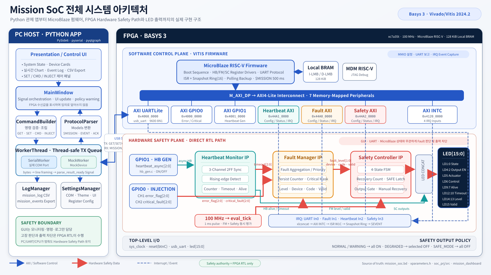

# Mission SoC 전체 시스템 아키텍처



이 그림은 실제 프로젝트의 Vivado Block Design, Vitis 통합 펌웨어와 Python
대시보드 소스를 교차 확인해 작성한 구현 기준 아키텍처다.

## 1. 핵심 경계

- Python 앱은 모니터링, 명령 전송과 로그 저장만 담당한다.
- MicroBlaze 펌웨어는 AXI 레지스터 설정, UART 프로토콜, IRQ 처리와 상태 보고를
  담당한다.
- 실제 Fault 판단과 출력 차단은 CPU를 우회하는 다음 RTL 직접 경로가 담당한다.

```text
heartbeat_monitor
  -> fault_manager
    -> safety_controller
      -> LED / output policy
```

따라서 PC 앱, UART 또는 MicroBlaze가 정지해도 이미 설정된 Hardware Safety
Path의 Fault 판정과 SAFE_MODE 출력 차단은 계속 동작한다.

## 2. Vivado Block Design

### Memory Map

| Peripheral | Base Address | 용도 |
|---|---:|---|
| AXI GPIO0 | `0x4000_0000` | Error/Critical Fault Injection |
| AXI GPIO1 | `0x4001_0000` | Heartbeat Generator 출력 |
| AXI UARTLite | `0x4060_0000` | USB UART 9600 8-N-1 |
| AXI INTC | `0x4120_0000` | UART 및 사용자 IP IRQ 수집 |
| Fault Manager | `0x44A0_0000` | Fault 설정/상태/IRQ |
| Heartbeat Monitor | `0x44A1_0000` | Timeout 설정/상태/IRQ |
| Safety Controller | `0x44A2_0000` | State/Recovery/Output/IRQ |

> 실기 연결 시 Python 앱의 Baudrate를 반드시 `9600`으로 선택한다. 앱 코드의
> 초기 기본값은 `115200`이지만 Vivado AXI UARTLite와 Vitis 펌웨어는
> `9600 8-N-1`을 사용한다.

### 직접 연결

- `GPIO1.CH1 -> heartbeat_async[2:0]`
- `GPIO0.CH1 -> error_flag[2:0]`
- `GPIO0.CH2 -> critical_fault[2:0]`
- `Heartbeat.timeout[2:0] -> Fault Manager.timeout[2:0]`
- `Fault Manager.{level, device, code, valid} -> Safety Controller`
- `eval_tick(1 ms) -> Fault Manager + Safety Controller`
- `UART/FM/HB/SC IRQ -> xlconcat In0/In1/In2/In3 -> AXI INTC`

LED 출력은 `led_concat`으로 구성된다.

| LED | 의미 |
|---|---|
| `LD1:0` | System State |
| `LD4:2` | Output Enable |
| `LD5` | Actuator Enable |
| `LD6` | Control Valid |
| `LD9:7` | Heartbeat Alive |
| `LD12:10` | Heartbeat Timeout |
| `LD14:13` | Fault Level |
| `LD15` | Fault Valid |

## 3. Vitis Firmware

통합 애플리케이션은 `SOC_Pr_Vitis/soc_prj/src`가 활성 소스다.

- `main.c`: 전역 Disable → 설정 → Clear → INTC 등록 → 순차 Enable 부팅과
  5 ms 메인 루프
- `hb_gen.c`: GPIO1을 통한 장치별 Heartbeat 생성/중단
- `mission_ip_regs.h`, `*_regs.c`: HB/FM/SC와 GPIO의 MMIO 접근 계층
- `mission_intr.c`: IP IRQ 원인 읽기, W1C, 16-entry Snapshot Ring 저장
- `uart_proto.c`: `GET/SET/CMD/INJECT` 처리 및
  `$MISSION/$EVENT/$IRQ/$ACK/$ERR` 출력

메인 루프의 처리 순서는 Heartbeat 생성, UART RX, IRQ 플래그, Snapshot,
폴링 백스톱, 500 ms 주기 `$MISSION` 보고 순이다.

## 4. Python Dashboard

- `MainWindow`: Signal 연결, UI 갱신, 명령과 로그의 조립 계층
- `CommandBuilder`: 모든 TX 명령의 형식 및 범위 검증
- `WorkerThread + SerialWorker`: COM Port RX/TX와 thread-safe TX queue
- `MockWorker + MockDevice`: FPGA가 없을 때 동일 Signal 경로를 제공
- `ProtocolParser`: byte stream을 줄로 조립하고 Models로 변환
- `StateCard/DeviceCard/ChartPanel/EventTable`: 상태 시각화
- `LogManager`: `mission_log` 기록과 `mission_events` Export
- `SettingsManager`: COM/UI/설정값 저장

수신 데이터 경로는 다음과 같다.

```text
COM Port
  -> SerialWorker
    -> ProtocolParser
      -> ParseResult / Models
        -> MainWindow
          -> State / Device Cards
          -> Chart / Event Log
          -> CSV Log
```

송신 데이터 경로는 다음과 같다.

```text
Control / Injection UI
  -> CommandBuilder
    -> Worker TX Queue
      -> UART
        -> Vitis uart_proto
          -> GPIO or HB/FM/SC Registers
```

## 5. 확인에 사용한 구현 파일

- `SOC_Pr/soc_project/soc_project.srcs/sources_1/bd/mission_soc/mission_soc.bd`
- `SOC_Pr_Vitis/soc_prj/src/main.c`
- `SOC_Pr_Vitis/soc_prj/src/mission_intr.c`
- `SOC_Pr_Vitis/soc_prj/src/uart_proto.c`
- `SOC_Pr_Vitis/soc_prj/src/mission_ip_regs.h`
- `mission_soc_dashboard/mission_dashboard/main_window.py`
- `mission_soc_dashboard/mission_dashboard/serial_worker.py`
- `mission_soc_dashboard/mission_dashboard/protocol.py`
